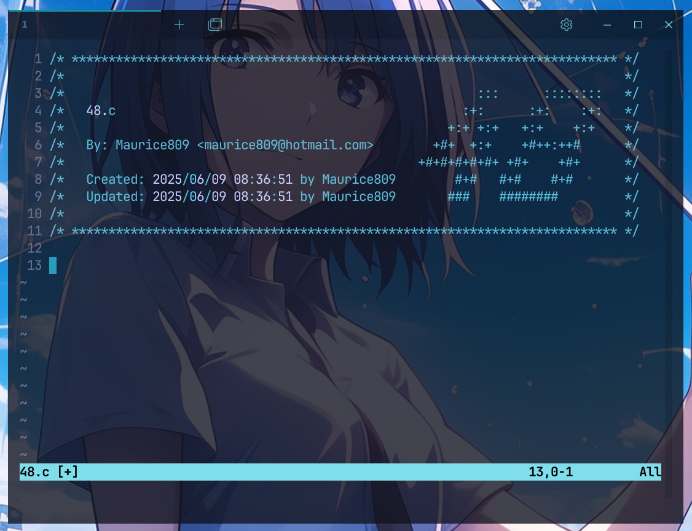

# **48 En-tête**

48 (Lausanne)

### **Description**

En-tête standard 48 pour l'éditeur Vim.



### **Configuration UNIX**

Copiez `stdheader.vim` dans votre répertoire `~/.vim/plugin`, ou utilisez votre gestionnaire de plugins préféré. Ensuite, définissez les variables utilisateur et mail comme expliqué ci-dessous.

#### Option 1 : exportez USER et MAIL dans le fichier de configuration de votre shell

Ajoutez dans votre fichier `~/.zshrc` :

+ `USER`
+ `MAIL`

#### Option 2 : définissez les valeurs de user et mail directement dans votre vimrc

```vim
let g:user48 = 'votreLogin'
let g:mail48 = 'votreLogin@student.48lausanne.ch'
```

### **Utilisation**

En mode **NORMAL**, vous pouvez utiliser `:Stdheader` ou simplement appuyer sur le raccourci <kbd>F1</kbd>.

Sous **Linux**, vous devrez éventuellement désactiver le raccourci **help** de votre **terminal** :

Pour **Terminator**, faites un clic droit -> Préférences -> Raccourcis -> changez l'aide pour un autre raccourci que <kbd>F1</kbd>.

### **Remarque**

Dans les clusters de **48**, vous pouvez facilement exécuter :

`$ ./set_header.sh`

### **Crédits**

[@zazard](https://github.com/zazard) - créateur  
[@alexandregv](https://github.com/alexandregv) - contributeur  
[@mjacq42](https://github.com/mjacq42) - contributeur  
[@sungmcho](https://github.com/lordtomi0325) - contributeur  
[@tmoret](https://github.com/maurice809) - contributeur

### **Licence**

Ce travail est publié sous les termes de la **[48 Unlicense]**.
